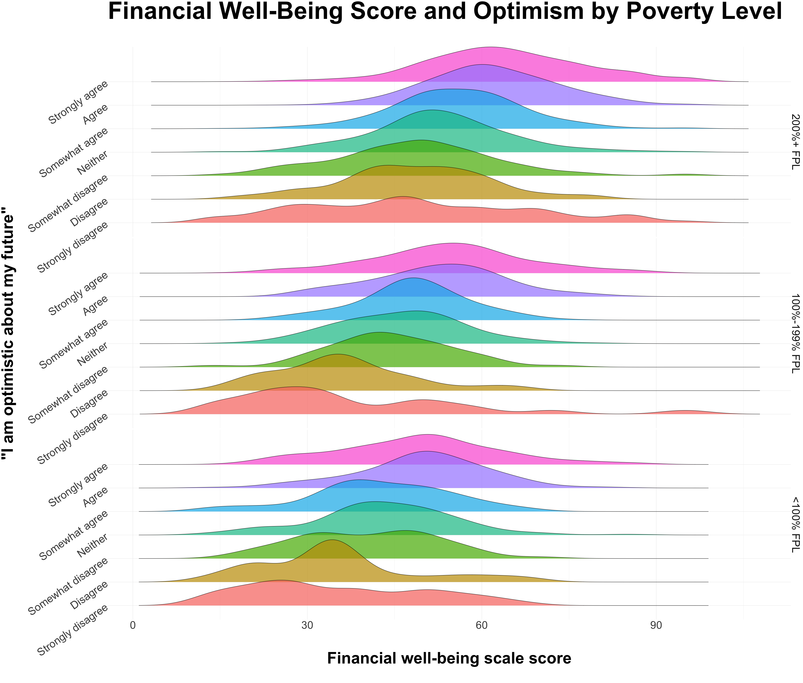
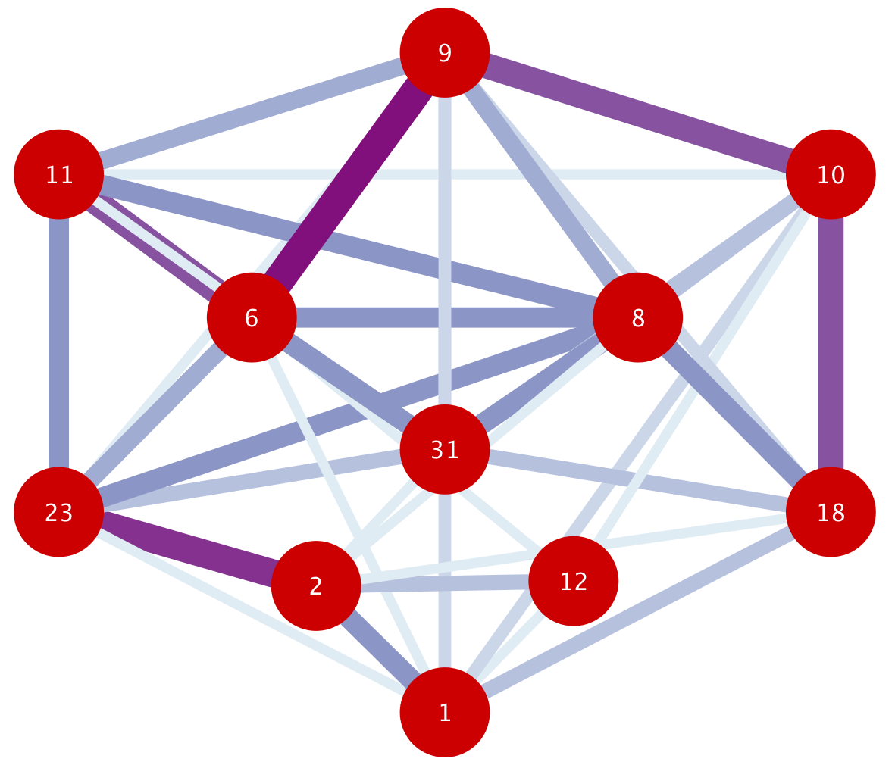
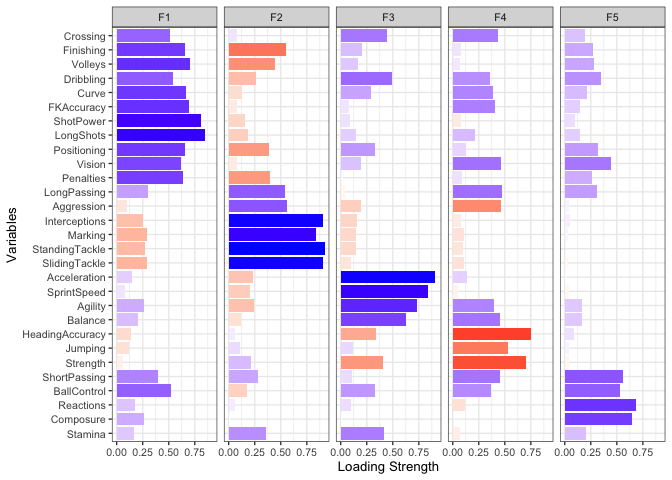

# Data Science Portfolio
This repository is a compilation of projects completed related to data analysis/data science during the past year of my education at Wesleyan University. Projects range from applications of network science on airline networks to exploring and discovering patterns in data on a FIFA 19 player dataset.

## Projects:

###  [The Role of Airlines in the Analysis of Correlation between Distance and Centrality in Air Transportation](https://github.com/skim09/data-projects/blob/master/airline-distance-centrality-analysis/README.md)
* Network analysis of European flight network with airports as nodes and flight paths as edges
* Exploration of differences in network characteristics if network is filtered by airline
* Focus on geography and centrality measures
* **Keywords** (Python, Network Science, Multiplex Analysis, Centrality Analysis, Flight Data)

---

###  [Account Half Full: The Association between Optimism and Financial Well-Being](https://github.com/skim09/data-projects/blob/master/optimism-financial-well-being-analysis/README.md)
* Explores whether there is an association between one's level of optimism and their level of financial well-being, and whether it varies across economic classes.
* Exhaustive analysis on univariate, bivariate, and multivariate levels.
* Focus on data visualization and presentation for a poster presentation.
* **Keywords** (R, Data Analysis, Linear Regression, Data Visualization, Consumer Finance Data)

---

###  [The Two Halves of Manchester United](https://github.com/skim09/data-projects/blob/master/manchester-united-network-analysis/README.md)
* Network analysis of two back-to-back matches played by Manchester United in the Premier League in 2018
* Analyze the passing network with players as nodes and passes as edges (both directed and undirected analyses)
* Identify key differences in tactical changes between halves in the same game
* **Keywords** (R, Network Analysis, Sports/Soccer Analytics, Manchester United Data)

---

###  [FIFA 19: A Study of Different Player Types](https://github.com/skim09/data-projects/blob/master/fifa-19-exploratory-analysis/README.md)
* Exploratory data analysis and pattern discovery on FIFA 19 player dataset.
* Application of cluster analysis and factor analysis on player attributes.
* Attempted merging of cluster analysis and factor analysis and breakdown of limitations.
* **Keywords** (R, EDA, Pattern Discovery, Cluster Analysis, Factor Analysis, FIFA 19 Data)

---

###  [Climate Change and Counteractive Methods: Air Conditioning Costs and Differences in Cooling Methods](https://github.com/skim09/data-projects/blob/master/climate-change-counteractive-methods/README.md)
* Application of quantitative methods in economics.
* Paper explores the differences in type of air conditioning equipment and their costs.
* Broader purpose of offering the argument that not taking steps to prevent climate change will end up costing American individuals more.
* **Keywords** (Stata, Regression Analysis, Climate Change, Energy Consumption Data)
