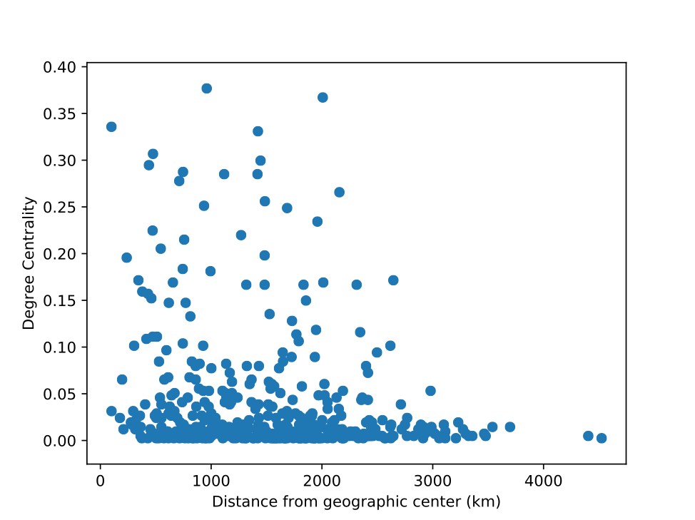

# The Role of Airlines in the Analysis of Correlation between Distance and Centrality in Air Transportation
### An Application of Network Science on European Air Networks

#### Background
For over two thousand years, the history of aviation has stood witness to mankind’s persistent and ultimately successful struggle to take to the skies. From kite-flying to space exploration, flight technology has developed spectacularly, and today the airplane is statistically the safest form of travel, with over 4 billion passengers having flown in 2017. With the advent of the commercial flight industry also came airports and flight plans, and today the modern air travel system closely resembles a network in which airports are the nodes and flights between them are edges. Much analysis has been performed on air flight networks, such as investigating the role of airline networks in predicting the spread of global epidemics or simply identifying structural characteristics like the average shortest path or degree distribution of a US air transportation network. However, these analyses are often conducted without accounting for the differences in airline companies that plan the flights themselves. Rather, the network is created without any distinction of airlines and simply as one big network with edges between airports (nodes) if there is a flight (regardless of airline) between them. This raises the question of what characteristic network differences come into light if each airline’s flight network is to be studied independently and compared to a greater cumulative network that combines said airlines. This is the question that will be addressed and answered in this paper, with a focus on geography and centrality measures.

#### Methodology
This paper focuses on the European air transportation network, for a number of reasons. First, it has a greater variety of cities in terms of both size and location, which means that there is a greater diversity in flights between cities. Second, Europe is a continent with many different countries, and airlines from different countries will have different flight networks, unlike airlines in the US, which are likely to have relatively similar networks as big cities like New York, Los Angeles, and Chicago will be of equal value to US airlines. The data was downloaded online from a publicly available website created by Alessio Cardillo titled “Air Transportation Multiplex”, containing the original paper of *Emergence of Network Features from Multiplexity* and the dataset used to conduct the analysis. The dataset contains three main files of 1) layers 2) nodes and 3) the multiplex. The layers file is a text file with the first column the numeric ID (1 - 37) of an airline company and the second column the string of the name of the company. The nodes file is a text file with 4 columns, the first being the numeric ID of an airport, the second a four character string of the airport’s ICAO code, and the third and fourth columns being the longitude and latitude, respectively. The multiplex file is a text file with 4 columns defined as airline, airport1, airport2, and weight. Each observation represents an existing flight (edge) between two airports (nodes) and the airline that operates it. Due to the overlapping nature of flights by airlines, the resulting graph is an undirected multigraph with multiple edges between the same nodes. The final network contains 417 nodes and 3588 edges. The technical analysis of this data was performed using Python. The NetworkX package was used to study the structure and dynamics of the network along with pyplot framework from the Matplotlib library to visualize basic graphs.

#### Analysis
*Finding the Geographic Center of Europe*

One of the key components of the analysis involves geographic distance between airports in real life. As the latitude and longitude coordinates for each airport are given, distances between nodes are calculated as the Euclidean distance between those two coordinates. This paper also investigates relationships between centrality measures and distance from the geographic center. I defined this as the mathematical average (sum/n) of longitudes and latitudes of all the airports in the dataset, which calculated to be a coordinate of 12.645 longitude and 48.652 latitude, which is somewhere in Landau an der Isar, Germany, near the border between Czechia and Austria.

*Centrality Measures of the Europe Air Transportation Network*

First, I look at the various measures of centrality of the entire European air network as a whole, including degree centrality, betweenness centrality, and closeness centrality. The below graphs plot each airport in the network with its centrality (in order of previous list) on the y-axis and its distance from the geographic center on the x-axis.

For degree and betweenness centrality we see a trend of relatively higher centralities in nodes with a lower distance from the center, but not following any discernible law or pattern. This makes sense for both degree and betweenness distribution, because airports that would have a high degree centrality are likely to have routes spreading in all directions, which is only really likely to be more centrally located (under 2500km from the geographic center) since we are only considering routes within Europe. As for betweenness centrality, it requires a bit more delicate approach to understanding, as there are not too as many values that are visibly separated from the pack. The top three betweenness centralities for this network are ENGM, LGAV, and LTBA, which translated from ICAO airport codes are Oslo Airport in Norway, Athens International Airport in Greece, and Istanbul Atatürk Airport in Turkey. These are all airports that are more on the peripheral areas, and it is likely that these airports have edges that connect to other, less popular airports, leading to these initial airports having a high betweenness centrality as very many paths would have to go through them to access the domestic airports on the corners of Europe. Closeness centrality is more linearly correlated, and had there been more airports with higher distances around the 4000 km there may be a more visible linear correlation, but nevertheless it is apparent the decreasing trend of closeness centrality as distance decreases. This signifies that the network does not have edges spanning from all areas to all other areas, but rather routes from one end to the other end of the Europe would require taking more edges (flights) to get there. If this were not the case, we would not see the trend of nodes being more centrally located geographically being able to reach other nodes in shorter paths (on average), and more peripherally located nodes taking longer to each other nodes (on average).

*Using Airlines as Layers to the Europe Air Transportation Network*

While the preliminary analysis on the entire network as a whole has uncovered some basic structural tendencies, it has yet to be seen what differences will manifest once we pick it apart by airline layer. Analyses are run on each layer by subsetting the graph by its ‘airline’ edge attributes. For each layer, the degree centrality, betweenness centrality, and closeness centrality was calculated for each airport, in addition to each airport’s distance from the geographic center (in Germany). Then, three airports, each with one of the highest degree centralities, were selected, but in 36 cases out of 38 airlines, all three airports were the same one; that is, one airport had the highest degree, betweenness, and closeness centralities.

**Airline** | **Most central city - degree** | **Distance from geographic center (km)**
--- | --- | ---
Lufthansa* | EDDM (Munich) | 100.37
Ryanair | EGSS (London Stansted) | 1418.09
Easyjet | EGKK (London Gatwick) | 1445.98
British Airways | EGLL (London Heathrow) | 1482.66
Turkish Airlines | LTBA (Atatürk International) | 1959.07
Air Berlin* | EDDT (Berlin Tegel) | 712.20
Air France | LFPG (Charles de Gaulle) | 1117.40
Scandinavian Airlines | EKCH (Copenhagen) | 756.76
KLM | EHAM (Amsterdam Schiphol) | 959.86
Alitalia | LIRF (Leonardo da Vinci-Fiumicino) | 746.23
Swiss International Airlines | LSZH (Zurich) | 471.588
Iberia | LEMD (Madrid-Barajas) | 2007.53
Norwegian Air Shuttle | ENGM (Oslo) | 1270.22
Austrian Airlines | LOWW (Vienna International) | 438.17
Flybe | EGHI (Southampton) | 1569.12
Wizz Air | EGGW (Luton) | 1482.51
TAP Portugal | LPPT (Lisbon) | 2644.67
Brussels Airlines | EBBR (Brussels) | 935.85
Finnair | EFHK (Helinski) | 1833.89
LOT Polish Airlines | EPWA (Warsaw Chopin) | 994.13
Vueling Airlines | LEBL (Barcelona-El Prat) | 1422.34
Air Nostrum | LEMD (Madrid-Barajas) | 2007.53
Air Lingus | EIDW (Dublin) | 2157.29
Germanwings | EDDK (Cologne Bonn) | 655.19
Panagra Airways | LTFJ (Istanbul Sabiha Gökçen) | 2011.90
Netjets | LSGG (Geneva) | 769.87
Transavia Holland | EHAM (Amsterdam Schiphol) | 959.86
Niki | LOWW (Vienna International) | 438.17
SunExpress | LTAI (Antalya) | 2344.72
Aegean Airlines | LGAV (Athens) | 1685.77
Czech Airlines | LKPR (Václav Havel Prague) | 237.81
European Air Transport | EDDP (Leipzig/Halle) | 304.76
Malev Hungarian Airlines | LHBP (Budapest Ferenc Liszt) | 743.64
Air Baltic | EVRA (Riga) | 1527.42
Wideroe | ENBO (Bodø) | 2023.94
TNT Airways | EBLG (Liége) | 825.87
Olympic Air | LGAV (Athens) | 1685.77

*\*Had different (but geographically close) values for betweenness and closeness centrality*

The above figure contains the airport with the highest degree centrality and its distance from the geographic center for each airline. Very often (36 out of 38) the airport with the highest degree centrality also had the highest betweenness and closeness centrality, marking that airport as the most central node of that airline network. However, the vastly diverse and wide range of values of distances from the center, ranging from as close as 100 km to as far as 2645 km shows that the center of a transportation network is heavily dependent on the airline in question. This has to do with the fact that there is no one all-encompassing “European” Airline, so each airline is affiliated with a specific country or a specific city. Lufthansa, for example, is the largest German (and incidentally largest European) airline headquartered in Cologne, and its most degree central airport is Munich Airport; British Airways is an airline of the United Kingdom, and fittingly its most degree central airport is London Heathrow Airport, and so forth all airlines have a certain national affiliation and its most central city is from that nation. So, we see that the entire European air network is a combination, or a layering, of many smaller networks of separate airlines that all operate revolving around their own home country and/or city.

Referring back to the first three figures involving the scatter plot with distance from the geographical center on the x axis and centralities on the y axis, these graphs were constructed under the assumption that there are no specific distinctions between airlines and the network is treated as such. So now, the x-axis variable is changed so that the values are not distances from the general geographic center in Landau an der Isar, but rather the geographic distances from the most central airport (node with highest degree centrality) *for each airline*. In other words, each airline has a different central node and a different centrality graph. Just as the multiplex network of Europe air transportation is constructed by layering the networks of airline routes, I created a scatter plot that is the product of essentially layering the scatter graphs of each airline on top of each other. The left figures contain graphs of distance from the overall highest degree centrality node (turning out to be Amsterdam Airport) against centralities, and the right column contains graphs of distance from the airline-respective highest degree centrality nodes against centralities.

<i>Network with no airline differentiation</i>

<i>Network with airline layering</i>

Already we see that when we treat the system as a composition of smaller “layer” networks, we get significantly different graphs than when we did while working with one united homogeneous network. There is a less noise and the data points are more centered around a specific pattern. For degree and betweenness centrality, there is a much stronger and obvious inverse relation, and the central node truly serves as a hub of sorts as many nodes that are or are very close to the most central node are more likely to be higher in degree or betweenness centrality as they have more connections between them and a lot of routes pass through the central area of the map. The closeness centrality, instead of having the slightly negative association that we had previously found, has a linear slope that appears to be 0. This suggests that airlines (in general) strive to create a route system in which it is possible to reach any other airport that they service without having to transfer multiple times within their airline. There are also some airports with very low closeness centrality even though they are close to the central airport of their airline, and this is most likely because they may be domestic airports on the periphery of the airline network that can only reach other international nodes by transferring to the central node (very likely an international airport) and then flying out of there, making all their shortest paths to other airports longer, and therefore their closeness centrality shorter.

*Understanding the Effect of Layering through Slopes*

To better understand and visualize the differences that come about through exploring a network that is composed of different layers, I found the *slopes*, a simple fitted line through the graphs that are displayed in the previous parts, and the different slopes for airlines are visualized as follows.

Each graph is constructed identically except for the centrality that is being measured. The x axis is composed of the different airlines, and the rightmost x value represents *all* airlines combined. The y value is the slope of points when nodes are graphed through a distance from the most central node vs. centrality graph. What this means is that if the height of the bar is above 0 and highly positive, on average the centrality in question goes up as distance from the center increases, i.e. the further an airport is for a particular airline, the more likely that it will have a high centrality. It is important to note that for these figures, “distance” is defined as the distance of an airport from the most central airport in the total network, which is Amsterdam Airport Schiphol, located in the Netherlands. With this information in hand, it is clear that all the airlines have different slopes, meaning that some airlines have airports with higher centralities far from the Netherlands and some airlines have airports with higher centralities near the Netherlands. It is clear that the rightmost slope value of *all* airlines combined cannot possibly represent the diverse range of slopes of all airlines. To consider why airlines have different slopes, a look at the most extreme values show why. The top three highest slope airlines for degree centrality are Air Nostrum, TAP Portugal, and Aegean Airlines. These airlines are headquartered in Spain (Valencia), Portugal, and Greece. Portugal and Greece are at the very corners of the European map with Amsterdam at the center, and while Valencia is a little bit closer Air Nostrum is also a regional airline and does not have many flights extending past Spain. Thus, we see that the top three airlines are centered around cities and countries that are very far from the most central node of Amsterdam, and thus have high positive slopes. The three most negative airline slopes are Brussels Airlines, Transavia Holland, and Germanwings, which are Belgian, Dutch, and German. It is no coincidence that Belgium and Germany are the two countries that share a border with the Netherlands, and thus a negative slope makes sense, as for these airlines they would have less central nodes the farther away from Amsterdam they get. Similar results hold for the other centralities, with Niki (a low-cost Austrian airline) showing high positive slopes for betweenness and closeness and TNT Airways (another Belgian airline) showing high negative slopes for betweenness and closeness. The underlying mechanism is the same, as all these airlines are headquartered in different places and do not construct their route networks to revolve around Amsterdam, even if it is the most central airport for Europe as a whole; rather, the airlines function more clearly around their *own* central airports.

If one changes the definition of “distance” to mean not the distance of an airport from Europe’s most central node but rather the distance of an airport from an *airline*’s most central node, striking changes occur. The bottom figures are constructed in the exact same manner as the ones above, except now the distances have been defined differently for each airline.

Immediately it is glaring how almost every slope is now strongly negative, meaning that centrality decreases as distance increases. In context, it signifies that the farther airports are from the most central airport, they are less well connected, which makes sense because airlines will be most well connected near their country of origin and nearby countries, and not so much far from home. However, it is more difficult to differentiate and reason why some airlines have stronger negative values and others do not. For example, three of the biggest airlines in Europe, Lufthansa, Ryanair, and KLM, have relatively lower than average values for centrality in almost all centralities. This can tentatively be attributed to the hypothesis that such huge companies likely have better, less concentrated flight routes that are relatively well connected even outside of their home countries. The strongest negative centrality slopes belong to the Flybe airline, which after some research shows that Flybe operates mainly short haul services to destinations throughout the United Kingdom, Republic of Ireland, and continental Europe. This notion of short haul services implies that most of the flight routes involve geographically close airports, and thus the likelihood of flights far away having any real connectivity to other airports is low. Generally, however, the trend of almost all slopes being negative points to the likely reality that most airlines construct flight routes around their own country, and the closer an airport is to that central home airport, the more likely it is to be connected in terms of node centrality. While it may be difficult to conjecture why certain airlines have certain values, conversely, such analysis may serve as a tool in which to gauge a certain airline’s strategy in route planning and whether the company is focused on long distance accessibility or regional monopolization of traffic.

#### Conclusion
This study has several limitations that give way to opportunities for further research and development in this area. First, the dataset was taken from a separate, independent research study, and as such is an incomplete dataset in that it does not contain all airlines (or possibly airports as well) in Europe, and it is undirected and unweighted. A more comprehensive study could account for the direction of flights (one-way vs. round trip) and the amount of passengers that actually travel the route under the specific airline. Additionally, many of the conclusions drawn are conjectural in nature, as the author is not an expert in either airline politics or airline business.

However, the implications of this study are clear in suggesting that the popular method of approaching airline networks without regard for the dynamic layering of independent layers may warrant reconsideration, as identical analyses on a network treated as a single entity and the same network treated as a product of layers of smaller networks returned markedly different results that led to differing interpretations. That is not to say that airlines must never be ignored; rather, it offers evidence in support of the conscious and active consideration of airline influences when embarking on research or study of commercial air transportation networks in general. As aviation history develops and new factors are constantly being brought in, network analysis would do well to adapt to and account for the ever-changing nature of technology and business.
