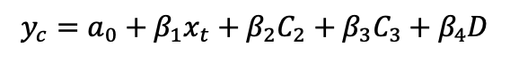
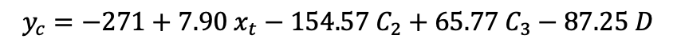

# Climate Change and Counteractive Methods: Air Conditioning Costs and Differences in Cooling Methods
### An Application of Quantitative Methods in Economics

#### Background
Last year, President Trump announced that the United States would pull out from the Paris climate agreement, which was signed and put into effect in 2016. While the rules of the agreement prohibit any country from leaving before November 2020, there is no doubt that President Trump is working hard to downplay efforts to combat climate change and will continue to do so until the end of his tenure in office. He has told the public that he “doesn’t want to give trillions and trillions of dollars. I don’t want to lose millions and millions of jobs. I don’t want to be put at a disadvantage.” (Murphy 2018) The president believes that investing in the Paris agreement would cost “trillions and trillions” of dollars, and from an economic standpoint believes it to make more fiscal sense to leave things as they are.

There is an ongoing debate to the validity of the president’s statements. Think tanks opposed to the agreement have generated figures of losses for the US government in the deal, but Stanford University researchers have discovered conversely that the agreement would save the world tens of trillions of dollars in prevented climate damages (Friedman 2018). It is important to understand the effects that potential climate change can have on not just the global economy as a whole, but also on individuals living their daily lives and the amount of money that is spent in connection to the climate.

The purpose of this paper is to offer an argument that not taking steps to prevent climate change will end up costing American individuals. Many studies discuss the macroeconomic aspect of the problems, and so this paper aims to present a more personal perspective by analyzing the effect of rising temperatures to air conditioner usage and subsequent expenditure on running them. This paper also addresses the differences in type of air conditioning equipment used and identifies which systems cost more money than others. I also analyze the effect of using a dehumidifier in tandem with air conditioning on electricity cost. This paper, through a regression analysis, finds that increasing temperatures have a direct effect on the amount of money spent on air conditioning efforts, that window or wall based air conditioned houses spend less than do homes that have a central air conditioning unit or both, and that using a dehumidifier reduces the cost of electricity spent on air conditioning overall.

#### Literature Review
The motivation for this research paper comes from the article *Climate Change, Mortality, and Adaptation: Evidence from Annual Fluctuations in Weather in the US* (2011) by Olivier Deschênes and Michael Greenstone from the American Economic Journal: Applied Economics. The article studies the connection between mortality and daily temperatures in the United States, finding a statistically significant relationship where extremely cold and hot days are correlated with higher mortality rates. The paper also finds a nonlinear relationship between annual energy consumption and daily temperature (also in the US), but Deschênes and Greenstone are unable to declare the relationship statistically significant, something that they attribute to a flaw in their approach to the problem. The authors note that climate change is likely to result in “institutional adaptations,” and concede that their “approach fails to account for these adaptations.”  Despite these shortcomings, the paper closes on the idea that “the impacts of climate change will be felt throughout the planet.” (Deschênes,  Greenstone 2011)

Inspired by the preexisting literature I embark on this analysis with a narrowed down scope of the benchmark article. I choose to focus specifically on summer temperatures and air conditioning costs, and I hypothesize the following statements: (1) An increase in temperature will lead to an increase in electricity cost for air conditioning. When the temperature is higher, air conditioners have to bring down the internal temperature of a space more, and in that process will consume more energy, naturally leading to a higher cost. (2) Central air conditioning systems will cost more to operate than window/wall/portable units, and using both is more expensive than using either independently. Central air conditioning systems are designed to effectively cool an entire household and each of its rooms. This leads to a phenomenon where rooms that are not being used or have anybody in them are also cooled, leading to wasteful expenditure. (3) The utilization of a dehumidifier reduces the electricity bill when compared to not using a dehumidifier. Part of the discomfort of living in the summer comes from the humidity as much as it does from the temperature itself. Houses that use dehumidifiers may feel considerably less discomfort and consequently have a lower necessity for air conditioners, and will end up not using the air conditioners as much, and thus save more on air conditioning electricity.

#### Data
This paper uses data from the Residential Energy Consumption Survey (RECS), which is periodically administered by the U.S. Energy Information Administration (EIA). To create the dataset for this national survey, professional interviewers from the EIA collect information on individual households across the country, focusing on energy characteristics, habits, and household demographics. The most recent survey data is from 2015, which is used in this paper. For the 2015 RECS cycle, online and mail forms were used in addition to in-person interviewers for demographics and usage patterns, and the information is combined with data from the energy suppliers themselves, resulting in a comprehensive dataset spanning all the necessary variables. More than 5,600 households were surveyed, random selected to represent their respective regions (and the country) statistically.

The result is a large survey dataset consisting of 5,686 observations and 739 variables. Amongst those variables are several that pertain to the research question at hand:

CODE | Description
--- | ---
TEMPGONEAC | Summer temperature when no one is home during the day (Fahrenheit)
AIRCOND | A/C conditioning equipment used (Y/N)
COOLTYPE | Type of air conditioning equipment used
NOTMOIST | Dehumidifier used (Y/N)
DOLELCOL | Electricity cost for air conditioning in 2015 (dollars)

The main independent variable is TEMPGONEAC, which is the temperature measured inside the house during daytime in the summer when no one is home. The other available temperature variable is TEMPHOMEAC, which measures the household temperature when somebody is home, but this is not an accurate representation of real life temperatures, as active air conditioning and cooling efforts would bring temperatures indoors lower than the outdoors. The variable AIRCOND is a binary variable of whether or not a house uses air conditioning. This particular variable proves, however, to be redundant, as those households that answered “Yes” to this particular question are all contained within the observations with a non-missing value for the next variable in question, COOLTYPE. COOLTYPE is our first categorical variable and details the type of air conditioning equipment, where the value 1 corresponds to a central air conditioning system, 2 to individual window/wall or portable units, and 3 to both a central system and window/wall/portable units. The variable NOTMOIST has a binary value of 0 or 1, where 0 means that the household does not use a dehumidifier, and 1 means that the household does. Finally, the dependent variable DOLELCOL is a continuous variable in units of dollars, measuring the amount of money spent by a household on electricity for just air conditioning.

Prior to beginning my analysis, I perform some data cleaning to make the consequent analysis accurate and representative of the found data. According to the codebook, for variables TEMPGONEAC and COOLTYPE, a value of -2 indicates that the answer was not applicable, and thus I replace values of -2 with missing values (in Stata) so as to prevent them from interfering with the regression analysis. This affects just 737 of the observations, a small subset of the original 5,686 observations in the dataset, and leaves 4,949 observations to utilize in the regression analysis.
Before applying regression techniques I calculate descriptive statistics to better understand the dataset.

Variable | Mean | Std. Dev. | Min | Max
--- | --- | --- | --- | ---
DOLELCOL | 237.3805 | 277.8634 | 0 | 2860.01
TEMPGONEAC | 74.62619 | 5.645454 | 50 | 90

DOLELCOL (cost of air conditioning) has a mean of about $237.38, but a high standard deviation of $278.86, showing that the variance in money spent on air conditioning is great. It has a minimum value of $0, and a maximum value of $2860. We also see that the temperature ranges from 50 to 90, but is averaged around 74.6 degrees Fahrenheit, with a small standard deviation of 5.6 degrees.

COOLTYPE | NOTMOIST = 0 | NOTMOIST = 1 | Total
--- | --- | --- | ---
**1** | 3,016 | 540 | 3,556
**2** | 970 | 167 | 1,137
**3** | 211 | 45 | 256
**Total** | 4,197 | 752 | 4,949

For our categorical data, we see that about 3600 people use central air conditioning systems, about 1100 people use window/wall/portable units, and about 260 people use both. As for dehumidifiers, about 4900 don’t bother to dehumidify while about 800 do. The most common combination of air conditioner type and dehumidifier usage is using a central air system and not using a dehumidifier, and the least popular combination is using both air conditioning options and also using a dehumidifier.

#### Methodology
In this paper I work to answer the question of whether an increase in temperature has a direct effect on the amount of money spent on air conditioning. In parallel with this question, I also look to show the differences in spending between choice of air conditioner types and utilization of a dehumidifier. So, I use a linear regression model with dummy variables attached to account for the categories, and I estimate

where y_c is the amount of money spent on air conditioning for a household in 2015, in dollars. Each of the β_i (i=1,2,3,4) are the coefficients for the related variable, calculated through linear regression. x_t is the temperature at the surveyed home and is the independent variable. C_2 is the first instance of the dummy variable of air conditioner type, which is individual window/wall or portable units. C_3 is the second dummy variable of A/C type, which represents households that use both a central system and individual units. D is the final dummy variable corresponding to the use of a dehumidifier. The regression takes default categorical values to start with, and the chosen default dummy values are the central air conditioning system for the variable COOLTYPE and not using a dehumidifier for the variable NOTMOIST.

I run the regression equation on all observations of the data that had the relevant data (no missing values), inputting temperature as the independent variable, cost as the dependent variable, and air conditioner type and dehumidifier usage as the dummy variables. The default values for the dummy variables is 1 for air conditioner type, indicating usage of a central air conditioner system, and 0 for dehumidifier usage, indicating that the household does not use a dehumidifier.

The regression produces a table of data as shown below:

&nbsp; | Coefficient | Standard Error | t-ratio | p-value
--- | --- | --- | --- | ---
**Constant** | -271.39 | 50.51 | -5.37 | 0.000
**Temperature** | 7.90 | 0.67 | 11.74 | 0.000
**Portable Unit** | -154.57 | 9.10 | -16.99 | 0.000
**Both** | 65.77 | 17.28 | 3.81 | 0.000
**Dehumidifier** | -87.25 | 10.58 | -8.25 | 0.000

#### Results/Analysis
First, we see that the resulting coefficient for temperature change is 7.90. This means that for every degree increase in Fahrenheit of temperature, on average the American household spends $7.90 more in response to that change (keeping all other variables constant). The following coefficients are related to the categorical variables. The coefficient for using a window/wall/portable air conditioning unit is -154.57, signifying that households that use said units spend $154.57 *less* than households that use a central system. The coefficient for using both units is 65.77, meaning that households with both types of systems spend $65.77 more on electricity for air conditioning than households that use a central system, and $220.34 more than households that use window/wall/portable air conditioning units. The last coefficient for using a dehumidifier is -87.25, meaning that households that use dehumidifiers spend $87.25 less than households that don’t utilize a dehumidifier during the summer. The constant of -271.39 is insignificant to the analysis. Statistically it means that when the temperature in Fahrenheit during the summer is 0 degrees, then the amount of money spent on electricity is -$271.39. This is a side effect of doing a linear regression on a dataset in which the observations are limited to a value range of between 50 and 90. The constant in this equation serves merely to provide an accurate line of fit through the data.

The p-values for all coefficients are 0.000, meaning that they are statistically significant and allow us to reject the null hypothesis that the coefficient (for any of the variables) is 0. I can say with a confidence level of at least 99.9% that each of the variables has a significant effect on the cost of electricity on air conditioning.

These results support my initial hypotheses that (1) an increase in temperature leads to an increase in cost, (2) central air conditioning systems are more expensive to operate than window/wall/portable units and using both is more expensive than using one or the other, and (3) utilization of a dehumidifier ends up reducing the electricity bill as compared to not using one. These findings are significant in multiple contexts to the average individual living in the United States. On a smaller scale, this regression provides evidence that some methods on fighting the summer heat are more cost-efficient than others. My analysis suggests that consumers would be better off purchasing window/wall/portable air conditioning units than purchasing central or both systems. It also suggests that consumers would be well rewarded in implementing dehumidifiers into their homes and use them alongside air conditioning as it would save them money. This is an important finding as research suggests that there is a continuing warming trend on Earth, and each passing summer will be hotter than the one before (NASA 2018). While global powers are fighting to curb this growth, consumers must begin taking steps to deal with the summer heat and the economic side of that effort is a large factor in the decision making process. My data and analysis can help consumers make educated decisions on how best to save money when looking to create a habitable space inside their households against the sweltering heat. In a broader perspective, this paper provides a strong argument that people should be concerned about President Trump’s intentions to pull out of the Paris Agreement, citing economic and fiscal costs as one of the major reasons. I show that it is clear on the household level that increasing temperatures lead to increasing costs, and it is not difficult to imagine that on a larger, global scale of greater magnitude, increasing environmental damages due to climate change will lead to increasing fiscal costs of proportional magnitude. In relation to the article mentioned in the literature review, while the article has inconclusive analytical results, my paper has conclusive, statistically significant results. This difference most likely comes from the fact that my paper focuses on a smaller, simpler question, whereas the literary paper attempts to relate broader, more elastic concepts like climate change, residential energy consumption, and mortality rates.

#### Conclusion
This paper offers a strong argument that the United States should be concerned about the potential consequential fiscal costs of letting climate change go unchecked. President Trump suggests that the Paris Agreement will cost the nation and its taxpayers a fortune to fight a cause whose existence, in his opinion, is questionable. This paper suggests that climate change will have an immediate impact on consumers, starting inside their very own homes as increasing temperatures lead to higher electric bills. This paper also serves as a guide for consumers contemplating on the most cost-efficient ways to tackle the summer heat.

The world is not on track for its own climate agenda. If things do not change, and soon, the world will heat up in excess of 3.6 degrees Fahrenheit this century, a threshold that world leaders had regarded “unacceptably risky”. (Plumer, Popovich 2018) If global warming continues and temperatures climb, there are many predictable consequences that will undoubtedly begin to eat away at the foundations of the society that we as humans have built up. Sea levels will rise, lands will flood, hurricanes will become stronger and more intense, droughts and heat waves will become more prevalent, and these changes will persist beyond this century. In the face of this glaring reality, the leader of the United States has chosen not just to ignore it, but to take action to systematically dismantle even the small steps that the U.S. has managed to take so far in preventing this dangerous future. At the time of writing of this paper, negotiators are meeting in Katowice, Poland, for a UN climate change conference, to figure out national pledges and policies going forward. As António Guterres, the secretary general of the United Nations, said in Katowice, “We are still not doing enough, nor moving fast enough, to prevent irreversible and catastrophic climate disruption.” Ultimately, it will only be through an immediate, collective effort from the world that the consequences of climate change can be averted, and we must pray that we are not too late.
