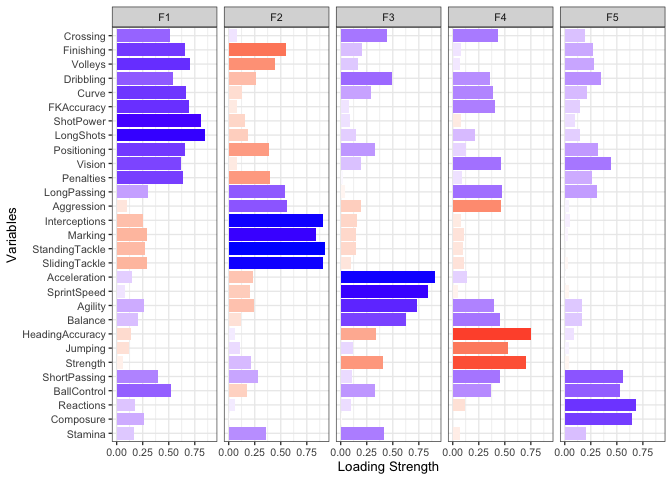

# FIFA 19: A Study of Different Player Types
### An Application of Data Exploration and Pattern Discovery Techniques to Video Game Data

Sangwon Kim, Changun Pyo, Yuan Wang

5/11/2019

#### Problem Statement
First, we want to find out whether there are specific types of players in the FIFA 19 game. If so, we want to characterize these player types. Second, we want to see if there are certain underlying dimensions of player attributes that we could uncover from relevant player attributes in the dataset. Answering these questions would help us better characterize the performance and characteristics of soccer players in FIFA 19, which could be utilized by gamers to assemble a high-performing team of players. Our results could also be potentially helpful for understanding player types and performance in real life. Lastly, we want to find out if we could find meaningful player clusters (types) based on the underlying dimensions (factors) that we’ve generated. We want to compare these results with our results from the first problem above and see if we could generate interesting conclusions or conjectures. This is more of a data science experiment that could reveal insights about the dataset and the methods that we have employed.

#### Data Description
This dataset was downloaded from the open source data science community Kaggle, uploaded by Karan Gadiya. The data itself was scraped from the website sofifa.com, which is an online website containing data of the FIFA 19 video game player database. The dataset is comprised of 18,207 observations (individual players) and 89 variables. The variables all describe a certain player, with some being basic descriptors such as Name, Age, Nationality, Club, Height, and Weight, and some are numeric values that determine a player’s in-game ability, such as Overall (Rating), Shooting, Passing, Sprint Speed, etc. These variables that rate a player’s ability are integers, ranging from scores of 0 to 100.

``` r
#summary(fifa)
## For presentation purposes, subsetted massive summary
fifa %>% select(Crossing:`Release Clause`) %>% summary
```

    ##     Crossing       Finishing     HeadingAccuracy  ShortPassing  
    ##  Min.   : 5.00   Min.   : 2.00   Min.   : 4.0    Min.   : 7.00  
    ##  1st Qu.:38.00   1st Qu.:30.00   1st Qu.:44.0    1st Qu.:54.00  
    ##  Median :54.00   Median :49.00   Median :56.0    Median :62.00  
    ##  Mean   :49.73   Mean   :45.55   Mean   :52.3    Mean   :58.69  
    ##  3rd Qu.:64.00   3rd Qu.:62.00   3rd Qu.:64.0    3rd Qu.:68.00  
    ##  Max.   :93.00   Max.   :95.00   Max.   :94.0    Max.   :93.00  
    ##  NA's   :48      NA's   :48      NA's   :48      NA's   :48     
    ##     Volleys        Dribbling         Curve         FKAccuracy   
    ##  Min.   : 4.00   Min.   : 4.00   Min.   : 6.00   Min.   : 3.00  
    ##  1st Qu.:30.00   1st Qu.:49.00   1st Qu.:34.00   1st Qu.:31.00  
    ##  Median :44.00   Median :61.00   Median :48.00   Median :41.00  
    ##  Mean   :42.91   Mean   :55.37   Mean   :47.17   Mean   :42.86  
    ##  3rd Qu.:57.00   3rd Qu.:68.00   3rd Qu.:62.00   3rd Qu.:57.00  
    ##  Max.   :90.00   Max.   :97.00   Max.   :94.00   Max.   :94.00  
    ##  NA's   :48      NA's   :48      NA's   :48      NA's   :48     
    ##   LongPassing     BallControl     Acceleration    SprintSpeed   
    ##  Min.   : 9.00   Min.   : 5.00   Min.   :12.00   Min.   :12.00  
    ##  1st Qu.:43.00   1st Qu.:54.00   1st Qu.:57.00   1st Qu.:57.00  
    ##  Median :56.00   Median :63.00   Median :67.00   Median :67.00  
    ##  Mean   :52.71   Mean   :58.37   Mean   :64.61   Mean   :64.73  
    ##  3rd Qu.:64.00   3rd Qu.:69.00   3rd Qu.:75.00   3rd Qu.:75.00  
    ##  Max.   :93.00   Max.   :96.00   Max.   :97.00   Max.   :96.00  
    ##  NA's   :48      NA's   :48      NA's   :48      NA's   :48     
    ##     Agility       Reactions        Balance        ShotPower    
    ##  Min.   :14.0   Min.   :21.00   Min.   :16.00   Min.   : 2.00  
    ##  1st Qu.:55.0   1st Qu.:56.00   1st Qu.:56.00   1st Qu.:45.00  
    ##  Median :66.0   Median :62.00   Median :66.00   Median :59.00  
    ##  Mean   :63.5   Mean   :61.84   Mean   :63.97   Mean   :55.46  
    ##  3rd Qu.:74.0   3rd Qu.:68.00   3rd Qu.:74.00   3rd Qu.:68.00  
    ##  Max.   :96.0   Max.   :96.00   Max.   :96.00   Max.   :95.00  
    ##  NA's   :48     NA's   :48      NA's   :48      NA's   :48     
    ##     Jumping         Stamina         Strength       LongShots    
    ##  Min.   :15.00   Min.   :12.00   Min.   :17.00   Min.   : 3.00  
    ##  1st Qu.:58.00   1st Qu.:56.00   1st Qu.:58.00   1st Qu.:33.00  
    ##  Median :66.00   Median :66.00   Median :67.00   Median :51.00  
    ##  Mean   :65.09   Mean   :63.22   Mean   :65.31   Mean   :47.11  
    ##  3rd Qu.:73.00   3rd Qu.:74.00   3rd Qu.:74.00   3rd Qu.:62.00  
    ##  Max.   :95.00   Max.   :96.00   Max.   :97.00   Max.   :94.00  
    ##  NA's   :48      NA's   :48      NA's   :48      NA's   :48     
    ##    Aggression    Interceptions   Positioning        Vision    
    ##  Min.   :11.00   Min.   : 3.0   Min.   : 2.00   Min.   :10.0  
    ##  1st Qu.:44.00   1st Qu.:26.0   1st Qu.:38.00   1st Qu.:44.0  
    ##  Median :59.00   Median :52.0   Median :55.00   Median :55.0  
    ##  Mean   :55.87   Mean   :46.7   Mean   :49.96   Mean   :53.4  
    ##  3rd Qu.:69.00   3rd Qu.:64.0   3rd Qu.:64.00   3rd Qu.:64.0  
    ##  Max.   :95.00   Max.   :92.0   Max.   :95.00   Max.   :94.0  
    ##  NA's   :48      NA's   :48     NA's   :48      NA's   :48    
    ##    Penalties       Composure        Marking      StandingTackle
    ##  Min.   : 5.00   Min.   : 3.00   Min.   : 3.00   Min.   : 2.0  
    ##  1st Qu.:39.00   1st Qu.:51.00   1st Qu.:30.00   1st Qu.:27.0  
    ##  Median :49.00   Median :60.00   Median :53.00   Median :55.0  
    ##  Mean   :48.55   Mean   :58.65   Mean   :47.28   Mean   :47.7  
    ##  3rd Qu.:60.00   3rd Qu.:67.00   3rd Qu.:64.00   3rd Qu.:66.0  
    ##  Max.   :92.00   Max.   :96.00   Max.   :94.00   Max.   :93.0  
    ##  NA's   :48      NA's   :48      NA's   :48      NA's   :48    
    ##  SlidingTackle      GKDiving       GKHandling      GKKicking    
    ##  Min.   : 3.00   Min.   : 1.00   Min.   : 1.00   Min.   : 1.00  
    ##  1st Qu.:24.00   1st Qu.: 8.00   1st Qu.: 8.00   1st Qu.: 8.00  
    ##  Median :52.00   Median :11.00   Median :11.00   Median :11.00  
    ##  Mean   :45.66   Mean   :16.62   Mean   :16.39   Mean   :16.23  
    ##  3rd Qu.:64.00   3rd Qu.:14.00   3rd Qu.:14.00   3rd Qu.:14.00  
    ##  Max.   :91.00   Max.   :90.00   Max.   :92.00   Max.   :91.00  
    ##  NA's   :48      NA's   :48      NA's   :48      NA's   :48     
    ##  GKPositioning     GKReflexes    Release Clause    
    ##  Min.   : 1.00   Min.   : 1.00   Length:18207      
    ##  1st Qu.: 8.00   1st Qu.: 8.00   Class :character  
    ##  Median :11.00   Median :11.00   Mode  :character  
    ##  Mean   :16.39   Mean   :16.71                     
    ##  3rd Qu.:14.00   3rd Qu.:14.00                     
    ##  Max.   :90.00   Max.   :94.00                     
    ##  NA's   :48      NA's   :48

#### Data Preprocessing
We performed a series of steps in order to prepare our data for analysis. Initially, we subsetted our data to only contain players that did not have a position value of “GK”, or goalkeeper, and had a minimum“Overall” rating of 75. We decided to do this for a number of reasons.First, goalkeepers are obviously unique as they are players that use their hands to keep the ball out of the goal, and even wear different colors to differentiate themselves. Goalkeepers would only create more noise in our analysis as they would be outliers in a study that looked mainly at players who spend the game playing the ball with their feet.Second, we decided to look at players with only a rating of 75 or above because any player lower than that is likely to be a (relatively) weaker player, playing in a lower league and is lesser known. Because of this, it is more likely that these players do not have skill attributes that truly represent their ability, and are more likely to have been computer generated by the developer of the game using some random algorithm.These players are also more likely to be colorless jack-of-all-trades players with no real unique style of play, and it would be less meaningful to perform an analysis on randomly generated player attributes.

After that, we subsetted the variables so that we were only looking at skill attributes (like Shooting, Sprint Speed, Stamina, Passing, Interceptions) and not goalkeeper attributes, as none of our players were goalkeepers. We also only kept some important basic attributes such as Name, Nationality, Club, Value, and others and discarded useless ones such as Photo, Flag, Logo, and the suitability ratings per position.

Lastly, we created a new set of values for the Position variable. It used to be composed of 27 different positions, many of which usually played in the same area. For example, ST and CF (Striker and Center Forward, respectively) are very similar positions and essentially play in the same area of the pitch. WB and FB (Wing Back and Full Back) are both positions that play in the back side corners of the pitch. As such, we had many positions that had overlapping purposes, and so we merged similar positions together to get a final list of 8 positions that contained the previous 27 positions and was much more interpretable. After performing these manipulations, we had our dataset ready to go for analysis. While there were initially missing values in the original dataset, this subset had no missing data, so no necessary missing data manipulation was required.

``` r
positions = as.factor(fifa$Position)
PlayArea = list(GK = c("GK"),
                DF = c("LWB", "LB", "LCB", "CB", "RCB", "RB", "RWB"),
                MF = c("LM", "LAM", "LDM", "LCM", "CDM", "CM","CAM", "RCM", "RDM", "RAM", "RM"),
                FW = c("LW", "LF", "LS", "CF", "ST", "RS", "RF", "RW"))
GenPosition = list(GK = c("GK"),
                FB = c("LWB", "LB", "RB", "RWB"),
                CB = c("LCB", "CB", "RCB"),
                DM = c("LDM", "CDM", "RDM"),
                CM = c("LCM", "CM","RCM"),
                AM = c("LAM", "CAM", "RAM"),
                WI = c("LM", "LW", "LF", "RF", "RW", "RM"),
                FW = c("LS", "CF", "ST", "RS"))

levels(positions) = GenPosition

fifa = fifa %>% mutate(Position = positions) %>% filter(!is.na(Position) & !is.na(Wage) & !is.na(Value))


fifa_analysis = fifa %>% filter(Overall >= 75) %>% filter(Position != "GK")
fifa_analysis = fifa_analysis %>% select(ID:Age, Nationality, Position, Overall:Club,
                                         Value, Wage, `Weak Foot`, `Skill Moves`, Height:Weight,
                                         Crossing:SlidingTackle)
fifa_abilities = fifa_analysis %>% select(Crossing:SlidingTackle)
```

-----

#### Statistical Approaches
For basic data visualization, we plotted the distribution of overall
scores and that of condensed positions for both the entire dataset and
the subset that our study focuses on. These are bar plots, with each bar
corresponding to a particular value in either the overall score column
or the condensed position column, and the height of the bar
corresponding to the number of rows that takes such a value in the
corresponding column.

``` r
ggplot(fifa_analysis) +
  geom_histogram(aes(x = Overall), fill = "cornflowerblue", color = "white", binwidth = 1) +
  ggtitle("Distribution of Overall Scores") +
  theme_minimal() +
  theme(legend.position = "none")
```

<!-- -->

``` r
ggplot(fifa_analysis) +
  geom_bar(aes(x=Position, fill = Position),
           color = "white", alpha = 0.7) +
  labs(title = "Distribution of Positions (Condensed)", x = "Position") +
  theme_minimal() +
  theme(legend.position = "none")
```

<!-- -->

After the basic visualization, we used factor analysis and cluster analysis. To answer our first question (in the problem statement), we used k-means cluster analysis on the quantitative performance variables to divide players into a certain number of clusters. We found the optimal number of clusters using a Scree plot, and used the k-means method to find these clusters. K-means clustering analysis first randomly selects n (a number that we choose based on the Scree plot) rows and then groups the rest of the rows to their closet neighbor within these n rows, thereby forming n groups of rows. It then creates n new rows, each of which is the mean of one group of rows, and each of these new rows becomes the “center” of their corresponding group. It uses these centers to generate a new grouping of all the rows, where each row is grouped with its closet center. It then calculates the mean of the rows in each group and thus generates the new centers. The process is repeated 25 times and the n groups we get at the end are the clusters. These clusters are grouped based on the the rows’ similarity with each other: the rows within each cluster are in general more similar to each other than with those not in the cluster.

To answer the second question, we used (principal axis) factor analysis on the quantitative performance variables to generate a number of “factors” that explain the most variation in the original variables. We again used the Scree plot to find out the optimal number of factors to choose. Then we used principal axis factor analysis with this number of factors. Each row gets a rating for each of the factors, and the value of a particular variable in a particular row could be expressed as the sum of values of the factors, each multiplied by a coefficient (greater than 0 and less than 1, uniform across all the rows), plus a residual term unique to each row. By using varimax rotation, we maximized the variance among the coefficients across different columns, so that we could better interpret these factors. In the end, we tried to interpret what each factor measures.

To answer the third question, we performed k-means cluster analysis on the factors that we generated in the second step. We ended up with clusters that reflect the similarity of the rows as measured by their values in these factors.

``` r
## CLUSTER ANALYSIS
# Scree plot - how many clusters?
fifa_st = scale(fifa_abilities)
fviz_nbclust(fifa_st, FUN = kmeans, method = "wss")
```

<!-- -->

``` r
# Fitting data
set.seed(1234)
fit.km = kmeans(fifa_st, 5, nstart = 25)
fit.km$size
```

    ## [1] 303 484 451 373 260

``` r
fit.km$center
```

    ##     Crossing  Finishing HeadingAccuracy ShortPassing    Volleys  Dribbling
    ## 1 -1.4493539 -1.5555187       0.8840460   -1.1292291 -1.4903910 -1.7426954
    ## 2  0.1579799 -0.5353153       0.1222469    0.1579367 -0.5041831 -0.1558338
    ## 3  0.5888030  0.6881518      -0.9437798    0.1919153  0.5777416  0.7983298
    ## 4  0.6271430  0.3919603      -0.3389133    0.9925800  0.5360159  0.5420101
    ## 5 -0.5260868  1.0532964       0.8654842   -0.7348888  0.9042989  0.1586299
    ##         Curve FKAccuracy LongPassing BallControl Acceleration  SprintSpeed
    ## 1 -1.58701935 -1.2488592 -0.53757030 -1.63087257 -1.080825295 -0.797305038
    ## 2 -0.16005535 -0.2726844  0.29830353 -0.13884218 -0.056283509  0.004624513
    ## 3  0.67330295  0.6125541  0.04092832  0.61953624  0.829947688  0.660565279
    ## 4  0.69522191  0.7431059  0.94516789  0.70197913 -0.046943408 -0.238431999
    ## 5 -0.01786059 -0.1656032 -1.35577461  0.07732672 -0.007943204  0.116789834
    ##      Agility   Reactions     Balance  ShotPower    Jumping    Stamina
    ## 1 -1.3712641 -0.47498058 -1.21697154 -1.3276666  0.3309182 -0.7297814
    ## 2 -0.1378485 -0.07547495 -0.03991382 -0.1627380  0.2960056  0.5464244
    ## 3  0.9299912 -0.06675075  0.77040334  0.2974055 -0.5580094 -0.2094846
    ## 4  0.2454514  0.51515664  0.35213036  0.4946803 -0.2861359  0.4315782
    ## 5 -0.1106451  0.07076983 -0.34898411  0.6246252  0.4417538 -0.4224877
    ##     Strength  LongShots Aggression Interceptions Positioning     Vision
    ## 1  0.8926483 -1.6275155  0.6888075     0.8333349  -1.8410685 -1.6486560
    ## 2  0.2080027 -0.2248610  0.5601392     0.7769552  -0.2002953 -0.1084536
    ## 3 -0.9935879  0.5560104 -1.0555193    -1.0315163   0.5735351  0.6039169
    ## 4 -0.1871699  0.6767559  0.1597393     0.5025511   0.4769356  0.8416240
    ## 5  0.5645260  0.3799205 -0.2436908    -1.3491713   0.8393282 -0.1317614
    ##    Penalties    Composure    Marking StandingTackle SlidingTackle
    ## 1 -1.2327487 -0.567161226  0.8985333      0.8866631     0.8962005
    ## 2 -0.4904146 -0.189402325  0.7363308      0.7904564     0.8203047
    ## 3  0.4847585  0.071263946 -0.9792665     -1.0333977    -1.0160140
    ## 4  0.4599256  0.622264081  0.3811671      0.4520418     0.3887143
    ## 5  0.8488662 -0.002784482 -1.2660224     -1.3607271    -1.3667090

``` r
# Adding clusters to dataset
fifa_analysis$Cluster = fit.km$cluster
```

``` r
########################################################################################
## FACTOR ANALYSIS
# How many factors?
screePlot(fifa_abilities, method = "pa")
```

    ##
    ## Note: parallel analysis suggests 6 factors.

<!-- -->

``` r
# Fitting the data using factor analysis
set.seed(1234)
fit.fa <- FA(fifa_abilities, fm="pa", rotate = "varimax", nfactors = 5)
```

    ##
    ## Principal Axis Factor Analysis
    ## Number of Factors: 5 / Rotation: varimax
    ##
    ## Factor Pattern
    ##                    F1    F2    F3    F4    F5   h2
    ## Crossing         0.51  0.08  0.44  0.43  0.19 0.68
    ## Finishing        0.66 -0.55  0.20  0.08  0.27 0.86
    ## HeadingAccuracy -0.14  0.06 -0.34 -0.75  0.09 0.71
    ## ShortPassing     0.40  0.28  0.11  0.45  0.56 0.77
    ## Volleys          0.70 -0.44  0.17  0.07  0.28 0.80
    ## Dribbling        0.54 -0.26  0.49  0.36  0.35 0.85
    ## Curve            0.67 -0.13  0.29  0.39  0.21 0.75
    ## FKAccuracy       0.69 -0.08  0.08  0.41  0.15 0.68
    ## LongPassing      0.30  0.54 -0.04  0.47  0.31 0.70
    ## BallControl      0.52 -0.18  0.33  0.37  0.53 0.83
    ## Acceleration     0.15 -0.23  0.91  0.14  0.01 0.91
    ## SprintSpeed      0.08 -0.20  0.84 -0.05 -0.04 0.77
    ## Agility          0.26 -0.24  0.73  0.40  0.17 0.85
    ## Reactions        0.18  0.06  0.10 -0.12  0.68 0.52
    ## Balance          0.20 -0.12  0.63  0.45  0.17 0.69
    ## ShotPower        0.81 -0.16  0.09 -0.08  0.10 0.72
    ## Jumping         -0.12  0.11  0.12 -0.53  0.04 0.32
    ## Stamina          0.17  0.36  0.42 -0.07  0.20 0.39
    ## Strength        -0.06  0.21 -0.41 -0.70 -0.04 0.70
    ## LongShots        0.85 -0.19  0.15  0.21  0.15 0.85
    ## Aggression      -0.10  0.56 -0.19 -0.46  0.04 0.58
    ## Interceptions   -0.25  0.91 -0.16 -0.08  0.05 0.92
    ## Positioning      0.66 -0.39  0.33  0.13  0.32 0.82
    ## Vision           0.62 -0.08  0.19  0.46  0.44 0.82
    ## Penalties        0.64 -0.40  0.02  0.09  0.26 0.64
    ## Composure        0.26  0.01 -0.01  0.00  0.65 0.49
    ## Marking         -0.29  0.84 -0.15 -0.11  0.03 0.82
    ## StandingTackle  -0.27  0.92 -0.15 -0.10  0.00 0.95
    ## SlidingTackle   -0.29  0.91 -0.10 -0.11 -0.03 0.94
    ##
    ##                         F1   F2   F3   F4   F5
    ## SS loadings           6.16 5.26 3.96 3.48 2.46
    ## Proportion Var        0.21 0.18 0.14 0.12 0.08
    ## Cumulative Var        0.21 0.39 0.53 0.65 0.74
    ## Proportion Explained  0.29 0.25 0.19 0.16 0.12
    ## Cumulative Proportion 0.29 0.54 0.72 0.88 1.00

``` r
# Adding factors to datset
fifa_analysis = score(fifa_analysis, fit.fa)
```

``` r
## CLUSTERING AFTER FACTOR ANALYSIS
fviz_nbclust(fifa_analysis[45:49], FUN = kmeans, method = "wss")
```

<!-- -->

``` r
set.seed(1234)
fit.kmFA = kmeans(fifa_analysis[45:49], 5, nstart = 25)
fit.kmFA$size
```

    ## [1] 311 329 483 375 373

``` r
fit.kmFA$center
```

    ##           F1         F2          F3         F4          F5
    ## 1 -1.5250076  0.3666974 -0.65069683 -0.5048161 -0.43823518
    ## 2  0.4690078 -1.4003214 -0.06904406 -0.9240005  0.21405554
    ## 3  0.1850447  0.8909976  0.68091790 -0.1982626 -0.06159109
    ## 4  0.0342040 -0.8231544  0.50328663  1.0375076 -0.21753273
    ## 5  0.5838358  0.6032008 -0.78427245  0.4495696  0.47504058

-----

#### Results
##### Cluster Results
``` r
## CLUSTER ANALYSIS RESULTS
# Plot cluster profiles
means = as.data.frame(fit.km$centers)
means$cluster = row.names(means)
dfm = gather(means, key = "variable", value = "value", Crossing:SlidingTackle)
ggplot(data = dfm,
           aes(x = variable, y = value, group = cluster, color = cluster, shape = cluster)) +
  geom_point(size = 3) +
  geom_line(size = 1) +
  labs(title = "FIFA Profiles for Clusters")+
  theme(axis.text.x = element_text(angle = 35, hjust = 1))
```

<!-- -->

-----

##### Cluster 1 Results

``` r
# Cluster Graph
ggplot(data = dfm %>% filter(cluster == 1),
           aes(x = variable, y = value, group = cluster, color = cluster, shape = cluster)) +
  geom_point(size = 3) +
  geom_line(size = 1) +
  labs(title = "Cluster 1 Profile") +
  theme(axis.text.x = element_text(angle = 35, hjust = 1))
```

<!-- -->

``` r
# Who are top 5 players in this cluster?
fifa_analysis %>% filter(Cluster == 1) %>%
  select(Name, Position, Club,
         Marking, SlidingTackle, StandingTackle, Strength,
         Positioning, Dribbling, LongShots, Vision) %>%
  head() # No-nonsense defenders
```

    ##           Name Position            Club Marking SlidingTackle
    ## 1     D. Godín       CB Atlético Madrid      90            89
    ## 2 G. Chiellini       CB        Juventus      93            90
    ## 3 K. Koulibaly       CB          Napoli      91            86
    ## 4    R. Varane       CB     Real Madrid      87            87
    ## 5   M. Benatia       CB        Juventus      89            85
    ## 6  M. Škriniar       CB           Inter      92            82
    ##   StandingTackle Strength Positioning Dribbling LongShots Vision
    ## 1             89       88          48        53        43     52
    ## 2             93       89          28        58        49     50
    ## 3             88       94          24        66        15     43
    ## 4             88       84          44        57        53     56
    ## 5             87       91          38        64        24     47
    ## 6             88       83          30        59        30     57

``` r
ggplot(data = fifa_analysis %>% filter(Cluster == 1)) +
  geom_bar(aes(x=Position, fill = Position),
           color = "white", alpha = 0.7) +
  labs(title = "Distribution of Positions (Limited Defenders)", x = "Position") +
  theme_minimal() +
  theme(legend.position = "none")
```

<!-- -->

**Limited Defender** cluster: This cluster includes players with high Marking, Sliding Tackle, Standing Tackle, Strength, and low Positioning, Dribbling, Long Shots, Vision attributes. This cluster has a high number of Centre-backs who play in front of a goalkeeper and serve as the last defender, preventing goals from forwards of the opposition team.

-----

##### Cluster 2 Results

``` r
# Cluster Graph
ggplot(data = dfm %>% filter(cluster == 2),
           aes(x = variable, y = value, group = cluster, color = cluster, shape = cluster)) +
  geom_point(size = 3) +
  geom_line(size = 1) +
  labs(title = "Cluster 2 Profile") +
  theme(axis.text.x = element_text(angle = 35, hjust = 1))
```

<!-- -->

``` r
# Who are top 5 players in this cluster?
fifa_analysis %>% filter(Cluster == 2) %>%
  select(Name, Position, Club,
         Marking, SlidingTackle, StandingTackle, Interceptions,
         Finishing, Penalties, Volleys) %>%
  head() # No-nonsense defenders
```

    ##            Name Position                Club Marking SlidingTackle
    ## 1  Sergio Ramos       CB         Real Madrid      87            91
    ## 2    M. Hummels       CB   FC Bayern München      88            88
    ## 3  Thiago Silva       CB Paris Saint-Germain      88            85
    ## 4     S. Umtiti       CB        FC Barcelona      90            86
    ## 5 J. Vertonghen       CB   Tottenham Hotspur      90            88
    ## 6         Piqué       CB        FC Barcelona      91            84
    ##   StandingTackle Interceptions Finishing Penalties Volleys
    ## 1             92            90        60        75      66
    ## 2             90            92        55        68      60
    ## 3             89            89        38        60      63
    ## 4             89            87        51        61      70
    ## 5             87            89        56        66      52
    ## 6             86            88        64        69      57

``` r
ggplot(data = fifa_analysis %>% filter(Cluster == 2)) +
  geom_bar(aes(x=Position, fill = Position),
           color = "white", alpha = 0.7) +
  labs(title = "Distribution of Positions (Ball Playing Defenders)", x = "Position") +
  theme_minimal() +
  theme(legend.position = "none")
```

<!-- -->

**Ball-Playing Defender** cluster: This cluster includes players with high Marking, Sliding Tackle, Standing Tackle, Interceptions attributes, and low Finishing, Penalties, Volleys attributes. Unlike the first cluster, this cluster has a large proportion of FB and (defensive) Midfielder players who participate on passing and ball carrying more than the CB, limited defender players.

-----

##### Cluster 3 Results

``` r
# Cluster Graph
ggplot(data = dfm %>% filter(cluster == 3),
           aes(x = variable, y = value, group = cluster, color = cluster, shape = cluster)) +
  geom_point(size = 3) +
  geom_line(size = 1) +
  labs(title = "Cluster 3 Profile") +
  theme(axis.text.x = element_text(angle = 35, hjust = 1))
```

<!-- -->

``` r
# Who are top 5 players in this cluster?
fifa_analysis %>% filter(Cluster == 3) %>%
  select(Name, Position, Club,
         LongPassing, ShortPassing, Vision,
         HeadingAccuracy, Jumping, SprintSpeed, Strength) %>%
  head() # No-nonsense defenders
```

    ##                Name Position                Club LongPassing ShortPassing
    ## 1          L. Messi       WI        FC Barcelona          87           90
    ## 2 Cristiano Ronaldo       FW            Juventus          77           81
    ## 3         Neymar Jr       WI Paris Saint-Germain          78           84
    ## 4         E. Hazard       WI             Chelsea          83           89
    ## 5         P. Dybala       WI            Juventus          75           87
    ## 6         S. Agüero       FW     Manchester City          64           81
    ##   Vision HeadingAccuracy Jumping SprintSpeed Strength
    ## 1     94              70      68          86       59
    ## 2     82              89      95          91       79
    ## 3     87              62      61          90       49
    ## 4     89              61      56          88       66
    ## 5     87              68      75          83       65
    ## 6     83              77      81          80       73

``` r
ggplot(data = fifa_analysis %>% filter(Cluster == 3)) +
  geom_bar(aes(x=Position, fill = Position),
           color = "white", alpha = 0.7) +
  labs(title = "Distribution of Positions (Passerss)", x = "Position") +
  theme_minimal() +
  theme(legend.position = "none")
```

<!-- -->

**Passer** cluster: This cluster includes players with high Long Passing, Short Passing, Vision attributes, and low Heading Accuracy, Jumping, Sprint Speed, Strength attributes. Most of the players who categorized as “passer” are Centre-Midfielders. These players are also called “playmakers” who usually results with most passing and most touches in the game.

-----

##### Cluster 4 Results

``` r
# Cluster Graph
ggplot(data = dfm %>% filter(cluster == 4),
           aes(x = variable, y = value, group = cluster, color = cluster, shape = cluster)) +
  geom_point(size = 3) +
  geom_line(size = 1) +
  labs(title = "Cluster 4 Profile") +
  theme(axis.text.x = element_text(angle = 35, hjust = 1))
```

<!-- -->

``` r
# Who are top 5 players in this cluster?
fifa_analysis %>% filter(Cluster == 4) %>%
  select(Name, Position, Club,
         Acceleration, Agility, Dribbling, SprintSpeed,
         Aggression, Strength, StandingTackle, Interceptions) %>%
  head() # No-nonsense defenders
```

    ##           Name Position            Club Acceleration Agility Dribbling
    ## 1 K. De Bruyne       CM Manchester City           78      79        86
    ## 2    L. Modrić       CM     Real Madrid           80      93        90
    ## 3    L. Suárez       FW    FC Barcelona           86      82        87
    ## 4     T. Kroos       CM     Real Madrid           64      70        81
    ## 5  David Silva       CM Manchester City           70      92        89
    ## 6     N. Kanté       DM         Chelsea           82      82        79
    ##   SprintSpeed Aggression Strength StandingTackle Interceptions
    ## 1          76         76       75             58            61
    ## 2          72         62       58             76            83
    ## 3          75         87       83             45            41
    ## 4          62         60       73             79            82
    ## 5          64         57       52             53            50
    ## 6          78         90       76             91            92

``` r
ggplot(data = fifa_analysis %>% filter(Cluster == 4)) +
  geom_bar(aes(x=Position, fill = Position),
           color = "white", alpha = 0.7) +
  labs(title = "Distribution of Positions (Dribblers)", x = "Position") +
  theme_minimal() +
  theme(legend.position = "none")
```

<!-- -->

**Dribbler** cluster: This cluster includes players with high Acceleration, Agility, Dribbling, Sprint Speed attributes, and low Aggression, Strength, Standing Tackle, Interceptions attributes. The dribblers are mostly wingers. These type of players are exposed in a 1-on-1 situation. To create chances from outside of the field, the game requires a high ability of dribbling and foot skills.

-----

##### Cluster 5 Results

``` r
# Cluster Graph
ggplot(data = dfm %>% filter(cluster == 5),
           aes(x = variable, y = value, group = cluster, color = cluster, shape = cluster)) +
  geom_point(size = 3) +
  geom_line(size = 1) +
  labs(title = "Cluster 5 Profile") +
  theme(axis.text.x = element_text(angle = 35, hjust = 1))
```

<!-- -->

``` r
# Who are top 5 players in this cluster?
fifa_analysis %>% filter(Cluster == 5) %>%
  select(Name, Position, Club,
         Positioning, Finishing, Penalties, Volleys,
         Interceptions, LongPassing, StandingTackle, SlidingTackle) %>%
  head() # No-nonsense defenders
```

    ##             Name Position                Club Positioning Finishing
    ## 1 R. Lewandowski       FW   FC Bayern München          91        91
    ## 2      E. Cavani       FW Paris Saint-Germain          93        89
    ## 3     G. Higuaín       FW               Milan          92        92
    ## 4      M. Icardi       FW               Inter          92        91
    ## 5      R. Lukaku       FW   Manchester United          89        87
    ## 6    C. Immobile       FW               Lazio          91        90
    ##   Penalties Volleys Interceptions LongPassing StandingTackle SlidingTackle
    ## 1        88      89            39          65             42            19
    ## 2        85      90            48          52             45            39
    ## 3        70      90            20          59             22            18
    ## 4        82      85            22          54             24            20
    ## 5        78      79            27          73             30            30
    ## 6        78      87            40          49             33            32

``` r
ggplot(data = fifa_analysis %>% filter(Cluster == 5)) +
  geom_bar(aes(x=Position, fill = Position),
           color = "white", alpha = 0.7) +
  labs(title = "Distribution of Positions (Finishers)", x = "Position") +
  theme_minimal() +
  theme(legend.position = "none")
```

<!-- -->

**Finisher** cluster: This cluster includes players with high Positioning, Finishing, Penalties, Volleys attributes and low Interceptions, Long Passing, Standing Tackle, Sliding Tackle attributes. Mostly, forwards who play at the very front position, finishers need the ability to score goals from the chances created by the teammates.

-----

##### Factor Analysis Results

``` r
## FACTOR ANALYSIS RESULTS
# Plotting the data
plot(fit.fa, type = "bar")
```

<!-- -->

``` r
# Naming factors in dataset
names(fifa_analysis)[45:49] = c("KICKING", "DEFENSE", "SPEED", "STRENGTH", "COMPOSURE")
```

Secondly, in factor analysis, we had the following underlying dimensions
of variables that are factored.

1) Kicking: Variables such as shot power and longshots are the top two attributes of this factor. Followed by variables such as volleys and penalties, we stated that this factor represents the kicking skill of the player.

2) Defense: Composition of highly correlated defending skill variables like interceptions and tackling, this factor represents the defensive skills of the player among all the attributes.

3) Speed: Acceleration, sprint speed, and agility all influence the speed of the players in the game. Since this type of attributes is needed for wingers, it also shows a meaningful amount of relationship with dribbling and crossing, too.

4) Strength: By multiplying negative 1 (-1) to the attributes colored red on the factor plot, the remaining variables like heading accuracy, jumping and strength is correlated with the physicality of the player.

5) Composure: The two main attributes in this factor, reactions and composure, can be described as mental abilities. Also, the high relationship with short passing and ball-control can be explained by claiming the calmness of a player could be helpful to control the ball under the pressure situation.

-----

##### Cluster Analysis + Factor Analysis

``` r
# Which clusters are strong in which factors?
clusters_by_factors = fifa_analysis %>%
  group_by(Cluster) %>%
  summarise(avgKICKING = mean(KICKING),
            avgDEFENSE = mean(DEFENSE),
            avgSPEED = mean(SPEED),
            avgSTRENGTH = mean(STRENGTH) * -1,
            avgCOMPOSURE = mean(COMPOSURE))
clusters_by_factors
```

    ## # A tibble: 5 x 6
    ##   Cluster avgKICKING avgDEFENSE avgSPEED avgSTRENGTH avgCOMPOSURE
    ##     <int>      <dbl>      <dbl>    <dbl>       <dbl>        <dbl>
    ## 1       1    -1.42        0.372  -0.836        0.540      -0.537
    ## 2       2    -0.0842      0.855   0.231        0.130      -0.0531
    ## 3       3     0.179      -0.873   0.492       -0.795      -0.0830
    ## 4       4     0.752       0.687  -0.0581      -0.386       0.578
    ## 5       5     0.419      -1.50   -0.225        1.06        0.0392

We combined our independently run cluster and factor analyses by averaging the factor scores of each cluster. For example, the first row means that players in Cluster 1 (Limited Defenders) were rated relatively much lower in kicking, speed, and composure, but relatively higher in defense and strength. These results make a lot of sense even just by taking a look at the most extreme values for each factor. The best ball kickers are passers and the worst are limited defenders, the best defenders are ball-playing defenders and the worst defenders are finishers, the fastest players are dribblers and the slowest are limited defenders, the strongest players are finishers and the weakest are dribblers, and the most mentally composed players are passers and the least composed are limited defenders.

-----

##### Cluster Analysis of Factors

``` r
## CLUSTER ANALYSIS AFTER FACTOR ANALYSIS RESULTS
set.seed(1234)
fit.kmFA = kmeans(fifa_analysis[45:49], 5, nstart = 25)
fit.kmFA$size
```

    ## [1] 311 329 483 375 373

``` r
fit.kmFA$center
```

    ##      KICKING    DEFENSE       SPEED   STRENGTH   COMPOSURE
    ## 1 -1.5250076  0.3666974 -0.65069683 -0.5048161 -0.43823518
    ## 2  0.4690078 -1.4003214 -0.06904406 -0.9240005  0.21405554
    ## 3  0.1850447  0.8909976  0.68091790 -0.1982626 -0.06159109
    ## 4  0.0342040 -0.8231544  0.50328663  1.0375076 -0.21753273
    ## 5  0.5838358  0.6032008 -0.78427245  0.4495696  0.47504058

``` r
# Plot cluster profiles
meansFA = as.data.frame(fit.kmFA$centers)
meansFA$cluster = row.names(meansFA)
dfmFA = gather(meansFA, key = "variable", value = "value", KICKING:COMPOSURE)
pFA = ggplot(data = dfmFA,
           aes(x = variable, y = value, group = cluster, color = cluster, shape = cluster)) +
  geom_point(size = 3) +
  geom_line(size = 1) +
  labs(title = "FIFA Profiles for Clusters after Factor Analysis")
plot(pFA)
```

<!-- -->

Lastly, in the cluster analysis of the five factors generated above, its results are simply not as interpretable as those of the previous cluster analysis. A lot of the nuanced deductions we were able to make based on the mean value of different variables in different clusters could not be made in these results, mostly because we have a much smaller number of variables. In addition, some of the clusters seem somewhat “odd”. For example, cluster 3 has the highest mean speed but also the highest mean defense. Based on our knowledge of soccer, such an association seems not to “make sense,” because the fastest players tend to be the attacking players. These oddities make the set of clusters harder to interpret.

#### Discussion
``` r
# Adding cluster profiles to dataset
fifa_analysis$FACluster = fit.kmFA$cluster
# Two way table of cluster and FAcluster
with(fifa_analysis, table(Cluster, FACluster))
```

    ##        FACluster
    ## Cluster   1   2   3   4   5
    ##       1 277   0   5   0  21
    ##       2  34   0 327   5 118
    ##       3   0  66  17 354  14
    ##       4   0   8 132  14 219
    ##       5   0 255   2   2   1

First, we will probe a bit deeper in the clusters generated from the factors, which we have been unable to interpret as well as we did the clusters generated from the 29 original quantitative variables. Above is a two-way table displaying the relationship between the two clustering. We can see that the two are not robustly correlated, especially for FACluster 2, 3, and 5. This means that the two methods generated rather different clusters. When we look at the most distinct (highest or lowest) variables for the different clusters, we notice that they are most strongly correlated with different factors. For example, the most distinct variables of Passers are Long Passing, Short Passing, Vision (highest), Heading Accuracy, Jumping, Sprint Speed, and Strength (lowest), and these variables span all the factors. If we see that the most distinct variables of a cluster generally correspond to the same factor, then we would be surprised by the variation in the two clustering. This is because if all the most distinctive variables of a cluster in the cluster analysis based on original variables are covered by the same factor, then the distinctness of the list of variables would likely be preserved by distinctiveness in that factor, and the cluster analysis based on factors would likely capture the same cluster. This is a speculative analysis.

Moving on to limitations, the database produced by Fifa19 in-game does not specify the source of data collection. This implies the credibility of the source of the data is unclear. Moreover, it is possible that some attributes are randomly generated by a random algorithm, thus the data for each individual is inconsistent with its calculation method. To solve this problem, we restricted the sample to over 75 overall scored players, with an assumption that more famous players will have a more accurate calculation of their attributes.

On the other hand, these attributes are only applicable for the 2018-2019 season of the soccer league. So the results of this study should not be generalized without further consolidation of previous data of the player.

In terms of literature review and research, we have not been able to find many relevant sources. There is a statistical analysis of soccer matches, but they involve the tracking of player movements during matches, and thus are based on a completely different type of dataset we the one we have analyzed in this project. Both Carling, Bloomfield, Nelson, et al. (2008) and Carling, Williams and Reilly, (2007) agree that motion detecting analysis could be very helpful in measuring player attributes in the realms of tactical, physical, behavioral and technical performance. Since our dataset measures certain similar capabilities (in our factor analysis, for example, we generated factors that were more physical-oriented and ones that were more technique-oriented), and we could try to incorporate data from motion-analysis studies into our models to strengthen our conclusions.

There is also a report by Torgler & Schmidt (2007) that concludes that both real income and relative income are correlated with soccer player performance, and that higher income is associated with better performance. Therefore, a further question to study would be a correlation between annual player income (included in this dataset) and their performance as measured by overall score or a composite score of different individual scores. However, since the variables are made up by a video game company, the results might not be meaningful. Still, it would be interesting to attempt such a study and see the results that one gets.


#### References
Benno Torgler., Sascha L. Schmidt (2007) What shapes player performance in soccer? Empirical findings from a panel analysis, Applied Economics, 39:18, 2355-2369, DOI: 10.1080/00036840600660739

C. Carling., J. Bloomfield., L, Nelsen., et al. Sports Med The Role of Motional Analysis in Elite Soccer (2008) 38: 839. <https://doi.org/10.2165/00007256-200838100-00004>

Christopher Carling., A. Mark Williams., Thomas Reilly (2007) Handbook of Soccer Match Analysis: A Systematic Approach to Improving Performance. <https://content.taylorfrancis.com/books/download?dac=C2009-0-23706-8&isbn=9781134302024&format=googlePreviewPdf>
