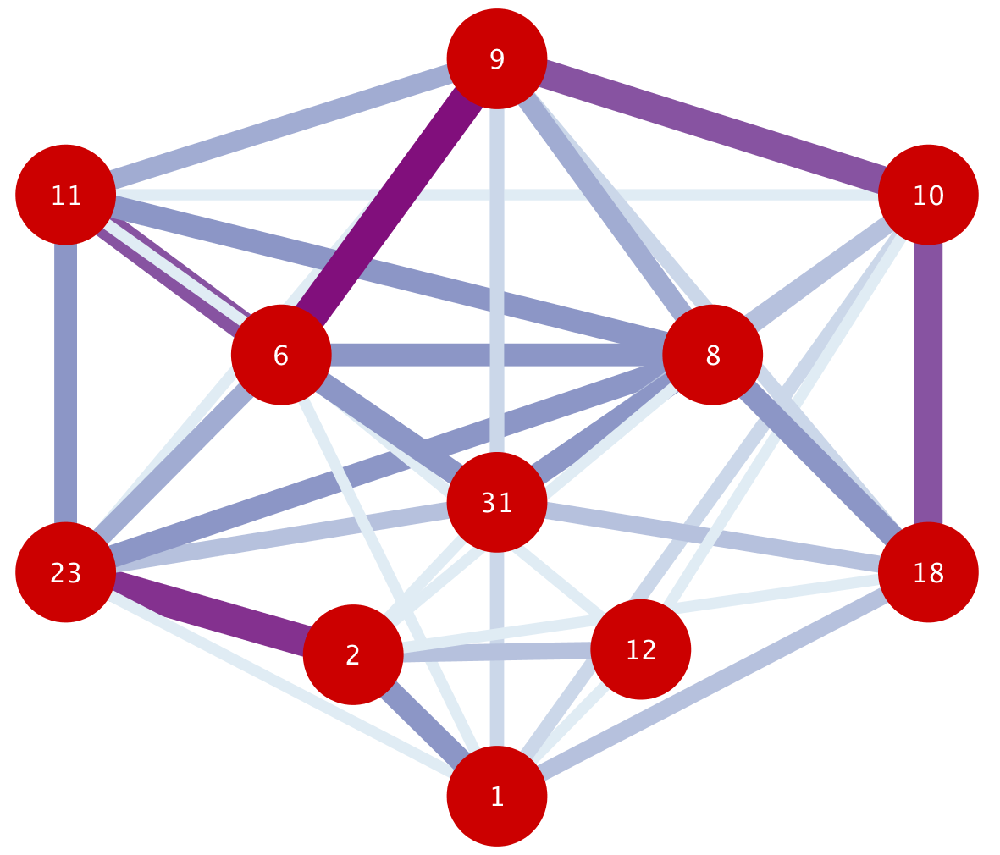

# The Two Halves of Manchester United
### An Application of Network Analysis on Premier League Football

#### Background
Manchester United Football Club are an English football club based in Manchester currently playing in the top division of English football, the Premier League. Originally established in 1878 as Newton Heath LYR Football Club, they changed their name to the now-worldwide brand of Manchester United in 1902 and moved to their present stadium, Old Trafford, in 1910. Once one of the most feared teams in the world with the legendary Sir Alex Ferguson at the helm, Manchester United have fallen quite a ways after his retirement and currently find themselves sixth in the league table, 16 points behind the leaders Liverpool. After cycling through four managers in five years (as compared to Ferguson leading United for 27 years), United appointed Portuguese manager José Mourinho, but he has fallen short of expectations this season. The team has been characterized by poor early starts and often leaving it late to come back and try to win the game (although not always to victory). This paper attempts to apply network analysis to Manchester United’s passing networks this season to identify differences in first and second half match performances, and possibly explain the discrepancy in quality of play.

#### Data
Data for professional level European football is collected by third party companies like Opta that independently analyze games and accrue data to sell to different organizations for a profit. This sort of data from independent companies is not readily available to independent researchers like myself, so I construct my own dataset by personally watching full match replays online and recording the necessary information directly. For this research paper I choose to focus on two specific matches played back to back this season by Manchester United: Newcastle United Football Club on October 6 and Chelsea Football Club on October 20. I select these particular games as they are perfect examples of United’s continuous habit of coming alive in the second halves this season. United concede two early goals in the first half against Newcastle United but come back to score three and win, and similarly concede a goal in the first half against Chelsea but score two in the second half, only to be annulled by a very fortunate goal for Chelsea right before the game ends. As such, these two games are representative of United’s playstyle, and as they were played in succession it also shows that it is a consistent trend in their style of play.
By watching and pausing frequently replays of these two matches I create an edge list consisting of two columns, “from” and “to”, in which the values are the numbers that the players have on their back. I count only successfully completed passes in which the ball is played from one United player and is received by another United player. I do this for each half of the two matches, and the Newcastle dataset has 538 observed passes and the Chelsea dataset has 293 observed passes. This disparity in number of passes can be explained by the fact that Chelsea are a much stronger squad, sitting just 8 points behind the Premier League leaders Liverpool while Newcastle are 29 points behind. I divide each of the datasets into their respective halves and end up with four total datasets, each containing the passing data for one half of a game.

#### Methodology
I use the language R and the open-source IDE RStudio to carry out my network analysis. I import the necessary datasets and install/load the packages dplyr and igraph to help with data structuring and network construction. With the data loaded I create an undirected adjacency matrix that tallies the number of passes from each player to all other players in a matrix. I create a graph using the data from this adjacency matrix as the weights of the edges, and then calculate the eigenvector centrality of each of the nodes. I choose the eigenvector centrality as a measure of a player’s importance within the passing network. The eigenvector centrality is a measure of the influence a player has, focusing on connectivity to other nodes that are themselves influential, and thus is a representative measures of which players the passing is centered around. After calculating the eigenvector centrality I return to the first step but create a directed adjacency matrix. I subset the 10 highest passing routes within the adjacency matrix and create a directed, weighted graph with just the passing routes that were played the most. I export the resulting graph as a graphml file so as to visualize in Cytoscape. I repeat this process for all four halves, leaving me with four eigenvector centrality measures, undirected graphs, and directed graphs.

#### Results/Analysis
The analysis of the results can be carried out in two parts, one for each game. In the initial Newcastle game, the opposition scores twice in the first half and Manchester United find themselves trailing by two goals to one of the weakest teams in the league. The eigenvector centrality calculation shows that the five most influential players in the half are Shaw, Martial, Pogba, Matic, and Smalling. All five of these players play on the left hand side of the formation and towards the back. The two least influential players are Lukaku and Rashford, the striker and right forward, who play up front and towards the right.

Figure 1a visualizes this lopsided nature. Each of the nodes represent the players’ relative position on the pitch, with the highest striker at the top and the deepest goalkeeper at the bottom (this format will be consistently applied through all figures). The blue nodes are the nodes with the highest eigenvector centrality, and the black nodes are the nodes with the lowest eigenvector centrality. It is clear that the players with the most influence in the passing networks are concentrated on the left hand bottom side, and the players playing high up and to the right are not as involved.

Figure 1b contains the graph of the undirected passing channels illustrates this point farther. The edges are colored and the widths of the edges are correlated with the weight of the edges. This means that the darker and wider an edge is, the more passes were given between the two players. The thickest and darkest lines are concentrated on the bottom left hand side, as expected, and the top right hand side contains only weak edges.

Figure 1c shows the graph of the top 10 directed passing routes during the half. The network is visually empty as the most utilized passing routes reach just one of the four highest attackers. It seems as though the most prevalent passing options involve swinging the ball around the back where it ends up at 23, the left back Luke Shaw, who continuously gives the ball to 11, the left winger Anthony Martial, who is the only reachable attacking option. It is clear that United are incapable of creating moves that reach the front and thus lack real threat, resulting in a poor first half performance.

In the second half, United manager José Mourinho implements a tactical change by putting number 6, Paul Pogba, one of the world’s best midfielders and a World Cup winner, as a holding midfielder just above the center backs and pushes the other midfielder higher to put five attackers higher up. Whether it was due to this change or not, an analysis on the second half immediately yields a huge difference in influential passers. The player with the highest eigenvector centrality is Pogba, and the next three influential players are Mata, Martial, and Rashford, three of the five players that play highest up the pitch. The least influential players are Smalling and Matic, the two center backs who play the farthest from the opposition goal, suggesting that United spent more time playing in the higher third than in the defensive third.

Figure 2a shows that the influential players are no longer concentrated on the left hand defensive side, but are spread out across the field, utilizing the right wing.

A look at the undirected passing graph in Figure 2b shows a more total use of all players and passing is not condensed in one corner of the field. When I subset the top 10 highest passes, I see that almost every player is reached except for Lukaku, the forward, as compared to the first half when three of the highest four players were not reached.

Figure 2c illustrates that United are playing as more of a cohesive team and bringing more of their players into the game. At the center of this movement is Paul Pogba, receiving four of the passing edges and releasing three of his own. With this sort of change in passing style and game plan, United play out the rest of the match in an exceptional manner, with goals from Mata, Martial, and Sánchez bringing the thrilling game to an end with United’s victory, 3-2.

---

The following match is played on October 20th, against Chelsea at the Stamford Bridge stadium. Chelsea is one of the strongest teams in the league and historically one of United’s bitterest rivals. In this game, United once again concede early in the game as Antonio Rüdiger scores and United fail to register any sort of real attempt at goal in the first half. A similar analysis on the first half yields similar results as the Newcastle game. The top 5 most influential players are Martial, Shaw, Matic, Mata, and Pogba. It is a little better than the previous game in that Mata is involved, but

Figure 3a shows that the influential players are still centered to the left and the right hand side is left wanting. The two least influential players are Smalling and Lukaku, the forward. Lukaku is once again cut off from the team and passes do not seem to be reaching the focal point of attack. Lukaku completes just four passes in the entirety of the first half.

Figure 3b is reminiscent of Figure 1b of the Newcastle first half, with the thicker and darker nodes along the bottom and left side, and the top nodes are very weakly connected.

Figure 3c takes the subset of the highest passing routes, and it illustrates the point even further as the ball is being played quite often to the left, and both Martial and Shaw are resorted to passing between themselves, trapped on the sideline, unable to move the ball forward or through the middle to the other side.

Despite this bleak showing, halftime comes as it always does, and once again the second half is a completely different story. The same analysis on the second half tells a completely different story. Most notably, Romelu Lukaku, the striker, is *the most* influential player in the squad. The following four are the next highest playing four players on the field. The bottom two players are the two center backs who sit the deepest. 

This results in a beautiful horizontally symmetric representation of eigenvector centrality, as shown in Figure 4a. I expect the following network analyses to reflect the change in influence of passing, and Figures 4b and 4c highlight those differences.

In Figure 4b, the stronger edges are focused on the top side, suggesting that more passes were played in the attacking half, and for the first time in four halves the passes are concentrated around the top right side, the complete opposite of what was happening in the first half. The subsetted passing routes drive the point home.

Compared to Figure 3c, Figure 4c represents a much more diverse network with all players involved in the game. The graph suggests fluidity in both passing and movement, as the passes do not conform to a singular pattern of bottom to top or right to left, but weave through players creating an interconnected network. To extrapolate a little, it seems as though the manager Mourinho uses Juan Mata, number 8, as a sort of distributor to make sure that the ball reaches all parts of the field, namely the wingers and the other two midfielders. Conversely, Paul Pogba, 6, is tasked with finding the striker, Romelu Lukaku, with his superior vision, creativity, and passing ability, thus leaving a single, strongly weighted edge directed from him to the striker. This change in movement and passing works to great extent in the second half as Martial scores twice in 20 minutes to give United the lead. United very unfortunately concede an undeserved goal in the dying minutes of the game at the 96th minute, but the fans go home happy with a positive result against Chelsea at Stamford Bridge and an even better display in the second half.

#### Conclusion
The network analyses of Manchester United’s games against Newcastle and Chelsea are characterized by two opposite sides of United’s ability. In the first halves, the team’s passes are concentrated on the left hand defensive side, showing a tendency to play safe and pull passes back and to the side. This leads to a natural dearth of supply to the front line, most specifically the striker Lukaku, the central striker. However, in the second half, United come around to play a game that involves the entire team and the front three players receive good supply. Not surprisingly, United score five goals over the second halves as compared to the zero goals in the two first halves. In particular, the passing is centered around Pogba and Mata, two of the most technically gifted players in the squad.

There are several theories that come up to possibly explain this discrepancy between halves. One theory is that Mourinho can only motivate the team during the half time team talks that are held within the 15 minute break between halves. However, this begs the question of why it is the half time talks and not the pre-game talks that make this difference. Another theory is that United only begin to play well when there is a sense of urgency and the looming fear of defeat over their heads. This would explain patterns in which United fall behind in the first half, because the score would drive them on to play with more risks as they are already on track to lose. A final theory is that the players are simply unhappy with the state of the club and the management that they do not start with the intensity and passion that is required of a side competing in top tier football. This is a theory that has been heavily pursued by the English and international media, often highlighting the supposed feud that is currently going on between Mourinho and Pogba.

Some possible solutions and reference points going forward are extractable from this paper. The analysis suggests that Pogba must be utilized to his full potential, as in each second half one of the differences has been that Pogba has woken up and been key to the passing network that turns the game around. United must also minimize their dependence on the left hand side. It seems that in the first half the ball is played often to the lift in an attempt to play without risk, and only in the second half when risk is no longer a big factor do they play better football without relying on the left side.

While the truth may be uncoverable by an outsider looking in to Manchester United, there is no argument that this sort of playstyle and habit is unsustainable. This cannot go on forever, and Mourinho must find a solution and inspire this very expensive squad to play at the top of their level once again. There is a lot of faith within the fan base that United can return to their former glory, but patience is slowly running thin as the team fails to put in good results week in and week out. José Mourinho is running on borrowed time.
