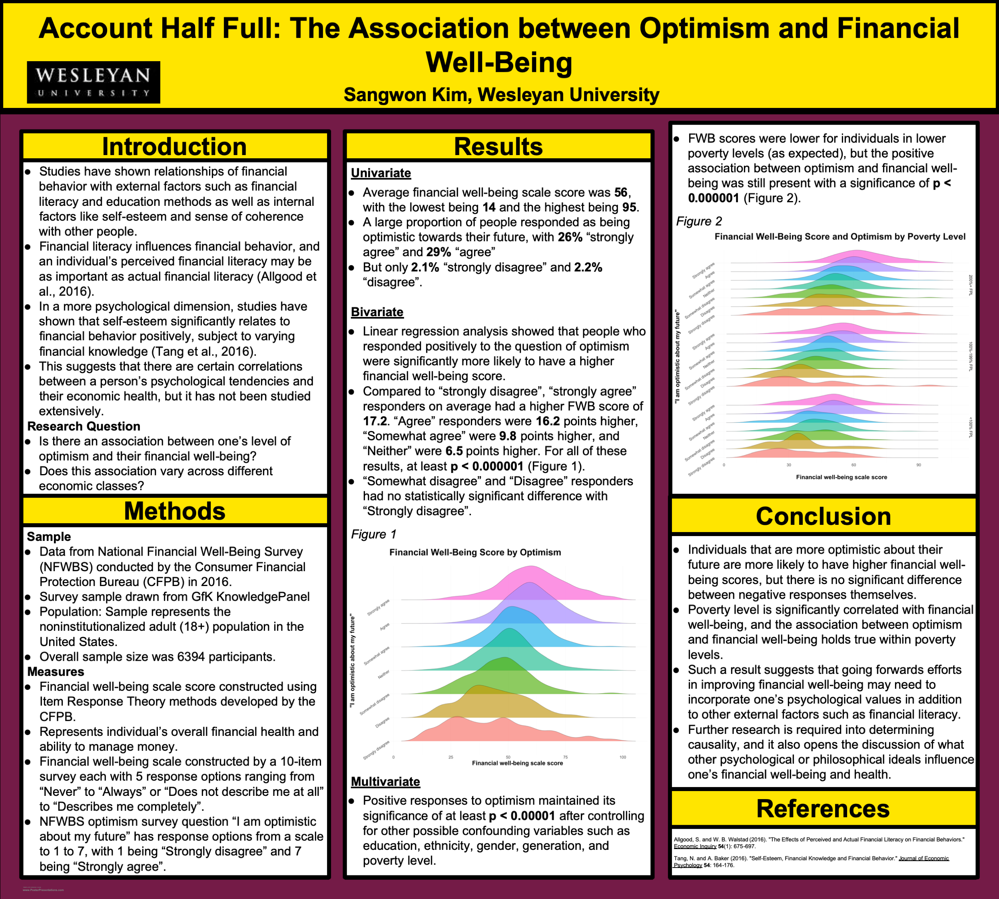
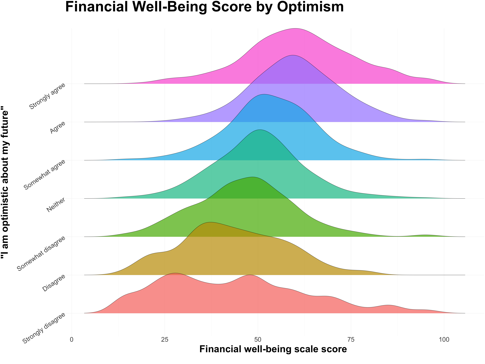

# Account Half Full: The Association between Optimism and Financial Well-Being

#### Introduction
* Studies have shown relationships of financial behavior with external factors such as financial literacy and education methods as well as internal factors like self-esteem and sense of coherence with other people.
* Financial literacy influences financial behavior, and an individual’s perceived financial literacy may be as important as actual financial literacy (Allgood et al., 2016).
* In a more psychological dimension, studies have shown that self-esteem significantly relates to financial behavior positively, subject to varying financial knowledge (Tang et al., 2016).
* This suggests that there are certain correlations between a person’s psychological tendencies and their economic health, but it has not been studied extensively.

Research Question
* Is there an association between one’s level of optimism and their financial well-being?
* Does this association vary across different economic classes?

#### Methodology

Sample
* Data from National Financial Well-Being Survey (NFWBS) conducted by the Consumer Financial Protection Bureau (CFPB) in 2016.
* Survey sample drawn from GfK KnowledgePanel
* Population: Sample represents the noninstitutionalized adult (18+) population in the United States.
* Overall sample size was 6394 participants.

Measures
* Financial well-being scale score constructed using Item Response Theory methods developed by the CFPB.
* Represents individual’s overall financial health and ability to manage money.
* Financial well-being scale constructed by a 10-item survey each with 5 response options ranging from “Never” to “Always” or “Does not describe me at all” to “Describes me completely”.
* NFWBS optimism survey question “I am optimistic about my future” has response options from a scale to 1 to 7, with 1 being “Strongly disagree” and 7 being “Strongly agree”.

#### Results

Univariate
* Average financial well-being scale score was 56, with the lowest being 14 and the highest being 95.
* A large proportion of people responded as being optimistic towards their future, with 26% “strongly agree” and 29% “agree”
* But only 2.1% “strongly disagree” and 2.2% “disagree”.

Bivariate
* Linear regression analysis showed that people who responded positively to the question of optimism were significantly more likely to have a higher financial well-being score.
* Compared to “strongly disagree”, “strongly agree” responders on average had a higher FWB score of 17.2. “Agree” responders were 16.2 points higher, “Somewhat agree” were 9.8 points higher, and “Neither” were 6.5 points higher. For all of these results, at least p < 0.000001 (Figure 1).
* “Somewhat disagree” and “Disagree” responders had no statistically significant difference with “Strongly disagree”.

Multivariate
* Positive responses to optimism maintained its significance of at least p < 0.00001 after controlling for other possible confounding variables such as education, ethnicity, gender, generation, and poverty level.
* FWB scores were lower for individuals in lower poverty levels (as expected), but the positive association between optimism and financial well-being was still present with a significance of p < 0.000001 (Figure 2).

#### Conclusion
* Individuals that are more optimistic about their future are more likely to have higher financial well-being scores, but there is no significant difference between negative responses themselves.
* Poverty level is significantly correlated with financial well-being, and the association between optimism and financial well-being holds true within poverty levels.
* Such a result suggests that going forwards efforts in improving financial well-being may need to incorporate one’s psychological values in addition to other external factors such as financial literacy.
* Further research is required into determining causality, and it also opens the discussion of what other psychological or philosophical ideals influence one’s financial well-being and health.

#### References
Allgood, S. and W. B. Walstad (2016). "The Effects of Perceived and Actual Financial Literacy on Financial Behaviors." Economic Inquiry 54(1): 675-697.
Tang, N. and A. Baker (2016). "Self-Esteem, Financial Knowledge and Financial Behavior." Journal of Economic Psychology 54: 164-176.
